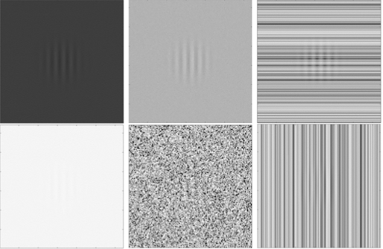
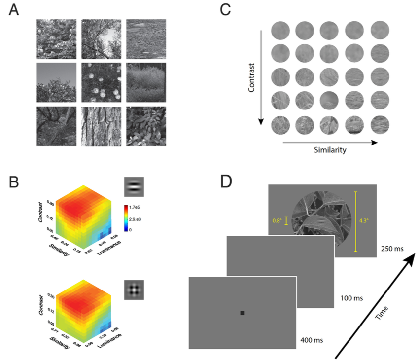
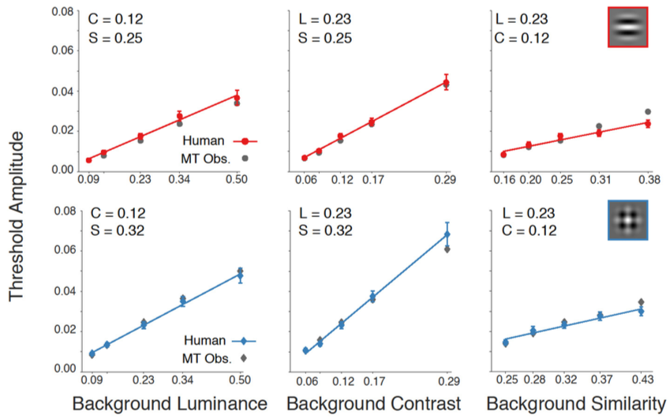
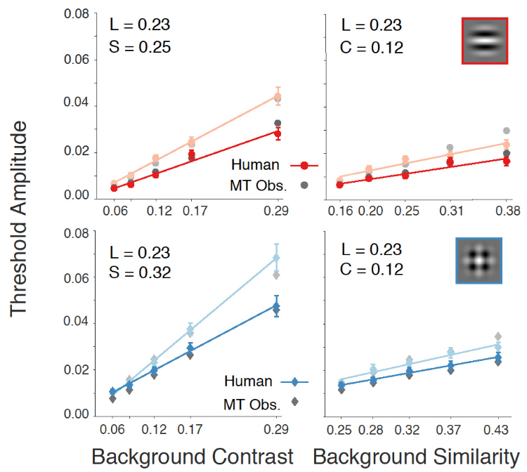
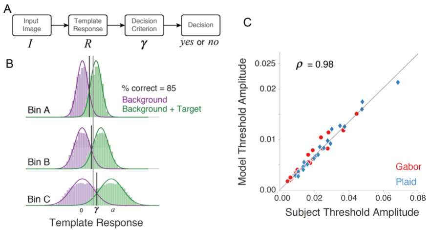
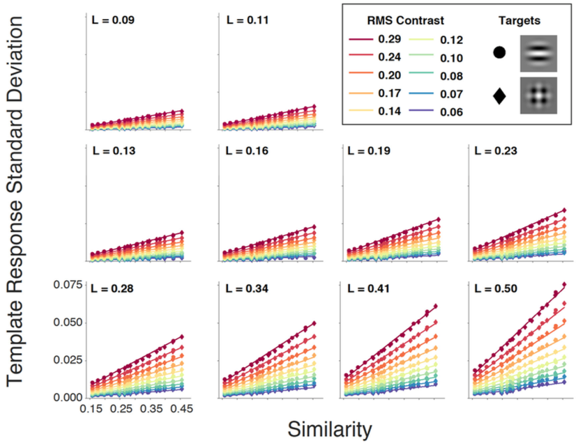
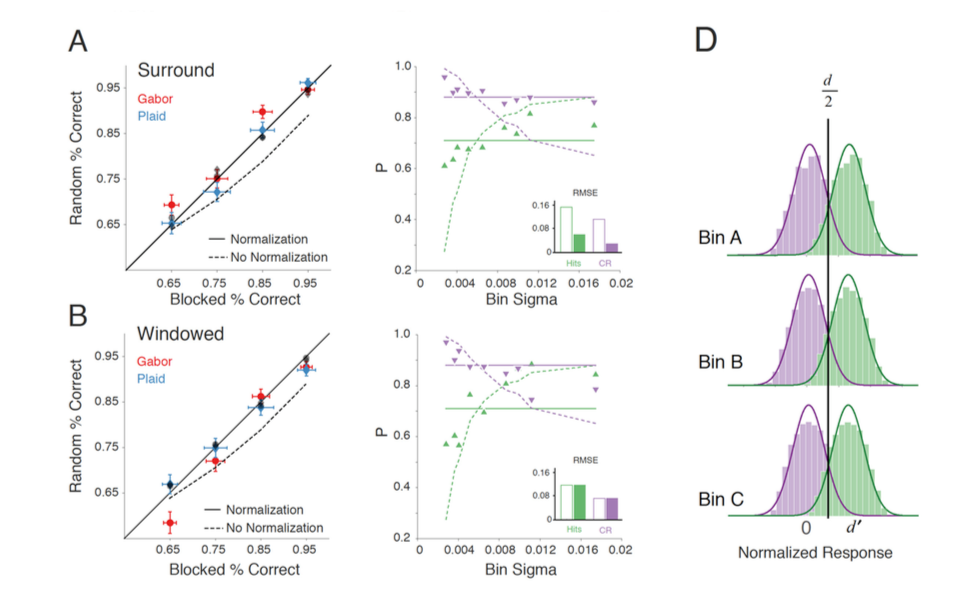

# Constrained Sampling Experiments Reveal Principles of Detection in Natural Scenes

Stephen Sebastian, Jared Abrams, and Wilson S. Geisler

PNAS (in press)

###### Presenter: Yimeng Zhang

###### 2017/06/22

---

# Take Home Messages

- Linear relationship between detection performance and background properties, such as luminance, contrast, and similarity to target.
- detection performance can be prediced by a very simple template matching linear model, in terms of its response to image patches.
- there is some normalization in the brain on for detection.

---

# Motivation

- detecting objects within a background scene: fundamental visual task, e.g. finding all the faces in a photo.
- object detection performance (for humans) depends on many factors --- **luminance, contrast, similarity (with target)**
- open question: how they impact detection individually and together, **in natural scenes** (previous studies use simple stimuli), and how this impact is related to scene statistics.

---

# Stimulus preparation

- two simple targets, grating and plaid
- collect a large sample of natural scene patches, with their luminance (L), contrast (C), similarity (S) w.r.t. target computed
- bining patches into 10x10x10 cubes for different targets separately. In B, color denotes # of patches. Notice imbalance.

---

# Experiment - general setup and metrics

- In general, study the detection performance under different combinations of L, C, and S
- Given L, C, S, target, and its amplitude $a>0$, they randomly sample a background patch $B(x,y)$ from that bin, and present the image $I(x,y) = B(x,y) + aT(x,y)$ on half of trials, and present $B(x,y)$ on the other half.
- Subjects report whether target is present at each trial.
- The performance is measured as **$a$ that gives overall 69% accuracy** of the task. This corresponds to $d'=1$, assuming same TP and TN rate. Check Eqs. (1.5) - (1.7) of *Detection Theory: A User's Guide, 2nd Ed.*, by Macmillan & Creelman

---

# Experiment 1 - with context

- they examine the relationship between $a$ and each of $L, C, S$, with other two fixed, **with** background context (see Fig. 2D)
- linear relationship, in agreement with Weber's law: linear relationship between stimulus and change of stimulus in order to have a fixed performance.

---

# Experiment 2 - without context

- same as Exp. 1, **without** background context; Luminance not explored, for reasons given at Exp. 3
- overall increased performance
- background context actually hurts detection, and this is predicted by their models as well. Probably due to influence of context on center background properties estimation

--- 

# Model 1: Matching Template (MT) observer

- given input image $I$, dot product it with template $f$, $f=T/(\|T\|^2)$, or $R = I\cdot f$ (Eq. 1). If $R > \gamma$, then consider target exists.
	- optimal detector in some sense.
- Given $L, C, S$, and assuming optimal $\gamma$, threshold amplitude is std of response. $a = \sigma(L, C, S)$.

---

# Model 1: Matching Template (MT) observer -- continued

- $\sigma(L, C, S)$ is linear w.r.t. $L, C, S$. See Eq. (3) and Fig. 6.
- The $a$ predicted from model response, given $L, C, S$ (which is unrealistic), matched that of humans, up to a scaling factor. See Eq. (4).

---

# Takeaways so far

- Linear model for detection performance and $L, C, S$. Figs. 3, 4
- Linear model for model response std and $L, C, S$. Fig. 6.
- human performance can be prediced by model response std. **This links Weber's law to scene statistics**.

## problems.

- $L, C, S$ are never known in reality.
- A linear model to predict $L, C, S$ from input image itself. See "estimation of local background properties" in supplement
- estimation of $L, C, S$ from input brings up their second model, for experiment 3.
	- I think model 1 is not used at all, as that needs access to ground truth $L, C, S$.

---

# Experiment 3 - Changing amplitude and background

- From previous experiments, each accuracy level (65%, 75%, 85%, 95%) corresponds to a number of $(L, C, S, a)$ combinations, under a "block" experiment design.
- This time, for each accuracy level, they randomly choose a combination of $(L, C, S, a)$ to present.
- no performance decrease for human; not achievable for (some kind of optimal?) MT model with fixed $\gamma$ (dash line in Fig. 7)

---

# Model 2: normalized MT observer.

- before comparing $R$ with $\gamma$, normalize $R$ with mean and std of response, at this level of $L, C, S$. Eq. (5), Fig. 7C
- A linear model to predict $L, C, S$ from input image itself. See "estimation of local background properties" in supplement
- this model matches human performance.
- implying some normalization in the brain.

---

# Discussion

- complete normalization **inconsistent** with sparse, non-Gaussian distribution of neural response.
- Real world detection can be harder.

---

# Technical Details

- L, C, S are estimated using the central part of bg patches, matching the size (0.8 deg) of the target. In stimulus presentation, the bg is presented as a 4.3 deg patch. Check Figure 2.
- while the raw pixel values of bg patches are measured in (gamma corrected) luminance (thus nonnegative), target has zero mean, as mentioned near end of Exp 3, or above Eq. (5).
   > Also, the grating and plaid targets integrate to zero and hence the target-absent distributions have a mean of zero.
- the reason experiment 2's performance drop is predicted by model, is probably that context would influence estimation of background properties a little bit, as they use some convolution when estimating these properties, and padding with zero (no context) is different from padding with context.

---

# Technical Details - 2

- In Expt 1 & 2, I think actually the normalized MT observer is used.
- In "Definitions of dimensions"
    - for $w$, they used a rotation-based 2D window. There are primarily two ways to generate a 2D window, from 1D window. Outer product and rotation. Both are fine. IMO, I like outer product better, as it can be generalized to any dimension. Check first two approaches in <https://en.wikipedia.org/wiki/Two_dimensional_window_design#2-D_Window_function_from_1-D_function>. In addition, according to various sources on Internet, such as <http://www.mathworks.com/matlabcentral/newsreader/view_thread/35512> (message 3 of 3), as well as Section 3.3.2 of "Multidimensional Digital Signal Processing", by Dan Dudgeon and Russell Mersereau (this is from reference of the above link), both flavors are fine.

---

# Technical Details - 3

- In "Definitions of dimensions"
    - when computing similarity, they use a "raised cosine ramp" to window the patch. This is simple, although I don't find many Google results. A linear ramp of 10 pixels, means `np.linspace(0, 1, 10)`. A raised cosine ramp of 10 pixels, means `np.cos(np.linspace(np.pi/2, 0, 10))`. That's all.
    - I think I will replace all windowing operation by 2D, outer product, Hann windows, for simplicity. These are generally for reducing border artifact, and should be similar no matter what window I use.

